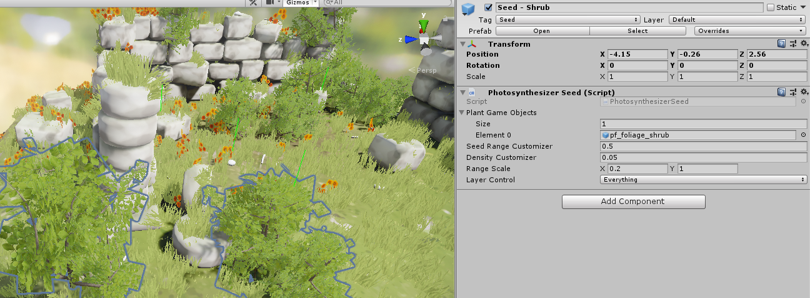
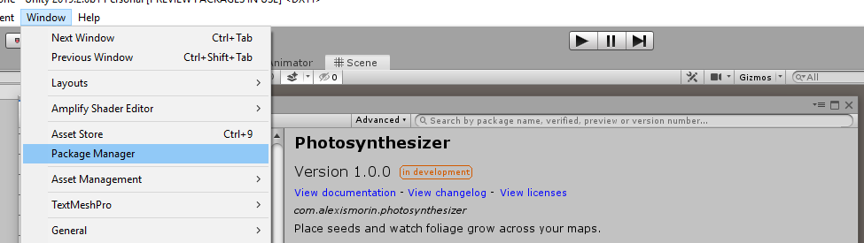

# Photosynthesizer
##  Unity plugin to procedurally sprout foliage throughout your scene.

I hate placing foliage so damn much! We know how it should clump together, spread intelligently throughout the scene and in general act as foliage should - yet it's a constant battle with the UE4 foliage tool or PolyBrush. Anyways, with this little tool you can now plant "seeds" throughout your map and procedurally see them blossom and flourish across your stuff.

### Usage - Unity 2019.2

The plugin is split into two components:

- Photosynthesizer Volume
- Photosynthesizer Seed

The volume is pretty brain-dead to use. You scale the collider around the seeds you'd like to affect (we'll get to those in an instant), set the number of weeks you'd like to generate your plants at (anything between 3-12 is good as a starter value) and press the *Regrow* button. 

The Seed component is where it's at. You place one inside of your scene, input your foliage mesh prefabs (remember to GPU instance your foliage shaders), adjust how fast you want the plant to grow with the *Seed Range Customizer*, the density with the... *Density Customizer* and you can also have a random scale for your meshes. That's all there is to it! It probably works at runtime.

### Installation - Unity 2019.2

This is a plugin that makes use of Unity's *Package Manager* feature. Just drop the *com.alexismorin.photosynthesizer* folder (found in the *packages* folder of the Unity Source folder) into your own project's *packages* folder (found at the same level as your Assets folder) and it should work out-of-the-box. If you're using a pre-packman version of Unity (whew!), navigate inside the *com.alexismorin.photosynthesizer* folder and then just drag all the stuff you find there anywhere in your project hierarchy (good luck!).

[Small demo video here, by the way!](https://youtu.be/BLAwU7__tSU) Considering making a UE4 version when I have the time - Message me if you'd like it and maybe that would give me the onus to do it 🤔

